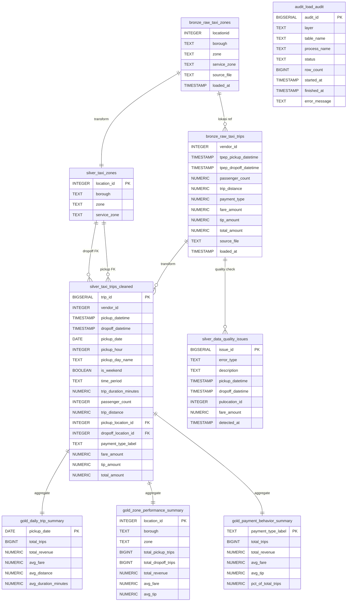

# Entity Relationship Diagram (ERD)

## Diagram Relasi



---

## Penjelasan Relasi Antar Tabel

### Bronze Layer
| Tabel | Deskripsi |
|-------|-----------|
| `bronze.raw_taxi_trips` | Data perjalanan taxi raw langsung dari file Parquet |
| `bronze.raw_taxi_zones` | Data lookup zone taxi raw dari file CSV |

### Silver Layer
| Tabel | Deskripsi |
|-------|-----------|
| `silver.taxi_zones` | Zone lookup yang sudah dibersihkan dari bronze |
| `silver.taxi_trips_cleaned` | Trip data valid dengan kolom turunan dan FK ke taxi_zones |
| `silver.data_quality_issues` | Record tidak valid yang difilter dari bronze |

### Gold Layer
| Tabel | Deskripsi |
|-------|-----------|
| `gold.daily_trip_summary` | Agregasi harian: total trip, revenue, avg fare |
| `gold.hourly_demand_summary` | Agregasi per jam: demand dan revenue |
| `gold.zone_performance_summary` | Performa per zone: pickup, dropoff, revenue |
| `gold.payment_behavior_summary` | Ringkasan per payment type |
| `gold.route_performance_summary` | TOP 1000 rute pickup-dropoff terpopuler |

### Audit
| Tabel | Deskripsi |
|-------|-----------|
| `audit.load_audit` | Catatan setiap proses load/transform pipeline |

---

## Constraint Detail

| Tabel | Constraint | Kolom | Keterangan |
|-------|-----------|-------|-----------|
| `silver.taxi_zones` | PRIMARY KEY | `location_id` | ID unik per zone |
| `silver.taxi_trips_cleaned` | PRIMARY KEY | `trip_id` | Auto-increment |
| `silver.taxi_trips_cleaned` | FOREIGN KEY | `pickup_location_id` | Referensi ke `silver.taxi_zones` |
| `silver.taxi_trips_cleaned` | FOREIGN KEY | `dropoff_location_id` | Referensi ke `silver.taxi_zones` |
| `silver.taxi_trips_cleaned` | NOT NULL | `pickup_datetime`, `dropoff_datetime`, `pickup_date` | Wajib ada |
| `silver.taxi_trips_cleaned` | CHECK | `trip_distance >= 0` | Tidak boleh negatif |
| `silver.taxi_trips_cleaned` | CHECK | `fare_amount >= 0` | Tidak boleh negatif |
| `silver.taxi_trips_cleaned` | CHECK | `tip_amount >= 0` | Tidak boleh negatif |
| `silver.taxi_trips_cleaned` | CHECK | `total_amount >= 0` | Tidak boleh negatif |
| `silver.taxi_trips_cleaned` | CHECK | `pickup_hour BETWEEN 0 AND 23` | Jam valid |
| `gold.daily_trip_summary` | PRIMARY KEY | `pickup_date` | Satu baris per hari |
| `audit.load_audit` | PRIMARY KEY | `audit_id` | Auto-increment |
```
